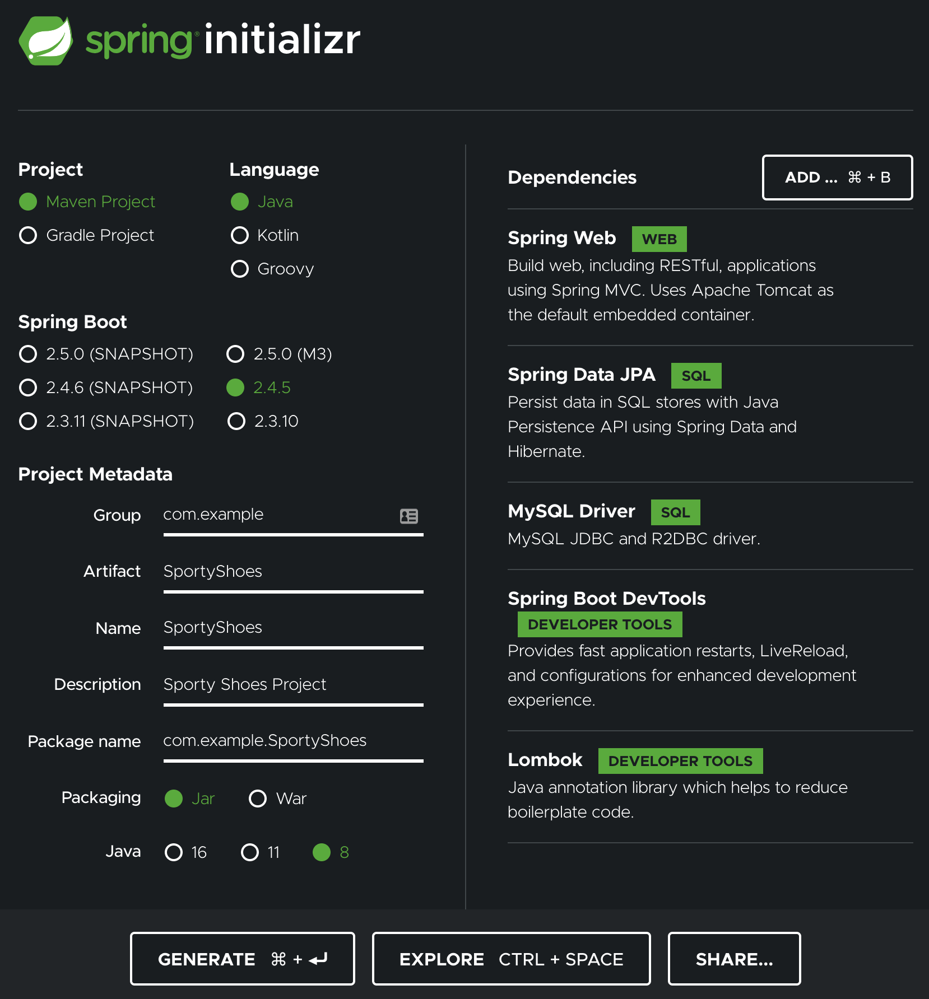

# Getting Started

This is a document on what we did to get started in the course.

This is *NOT* prescriptive. These are merely suggestions to get started and not in any way 
to be inferred as requirements for the project.

 
### SQL

Here is some SQL (not required) that you **could** use if you want to:

```sql
use my_database;
CREATE TABLE `user` (
  `id` int NOT NULL AUTO_INCREMENT,
  `email` varchar(255) DEFAULT NULL,
  `name` varchar(255) DEFAULT NULL,
  `password` varchar(255) DEFAULT NULL,
  PRIMARY KEY (`id`)
) ENGINE=InnoDB DEFAULT CHARSET=utf8mb4 COLLATE=utf8mb4_0900_ai_c
```

```sql
insert into user (email, name, password) VALUES ("tim@gmail.com", "Tim", "password");
insert into user (email, name, password) VALUES ("mary@gmail.com", "Mary", "password");
insert into user (email, name, password) VALUES ("lee@gmail.com", "Lee", "password");
```

## Steps

### Step 1: Create a GitHub Repo under your account.

If you don't already have a github repo, create one for this project. I actually recommend that you have a special repo
just for this project, but if you choose to combine it with other things from this class that should be ok as long as
its clear where you work from Sporty Shoes is.

### Step 2:  Create a Spring Initializer.

You can create as follows.  

Please note there are two modules you may want to consider:
1. Thymeleaf -- if you prefer thymeleaf views to JSPs.  Please see the SpringStarter project.
2. Spring Security -- Spring Security is rather complex but does have a lot of features around authentication and security.



Go ahead and unzip the SportyShoes.zip and put it in your git repository.


## Step 3: Import the Maven Project into Eclipse (or your IDE of choice)

Go Import -> Existing Maven Project.

Navigate to your git repo folder and find the SportyShoes subfolder.

Select the springtarter subfolder.


## Step 4: Edit application.properties.

Go to src/main/resources/application.properties
Add the following:

```text
spring.jpa.hibernate.ddl-auto=update
spring.datasource.url=jdbc:mysql://${MYSQL_HOST:localhost}:3306/db_example
spring.datasource.username=springuser
spring.datasource.password=ThePassword

logging.level.org.springframework.web: DEBUG
spring.mvc.view.prefix=/WEB-INF/jsp/
spring.mvc.view.suffix=.jsp
server.port=8090
```


## Step 5: Add some extra dependencies to `pom.xml` file

```xml
        <dependency>
                <groupId>javax.servlet</groupId>
                <artifactId>jstl</artifactId>
                <version>1.2</version>
        </dependency>


        <dependency>
             <groupId>org.apache.tomcat.embed</groupId>
             <artifactId>tomcat-embed-jasper</artifactId>
             <scope>provided</scope>
        </dependency>

````

You may need to use eclipse to "Reload Maven" after changing the pom.xml


## Step 6: Create Entity Class: User

Create a new class User.  It can be under the `com.example.SportyShoes` package.

It can look like this:

```java

package com.example.SportyShoes.entities;

import javax.persistence.Entity;
import javax.persistence.Id;

@Entity
public class User {
	
	@Id
	private int id;
	private String email;
	private String name;
	private String password;

}
```

Use your IDE of choice to generate setters and getters (Eclipse: Source -> Generate Setters and Getters). 
The result should look like this:

```java

package com.example.SportyShoes.entities;

import javax.persistence.Entity;
import javax.persistence.Id;

@Entity
public class User {
	
	@Id
	private int id;
	private String email;
	private String name;
	private String password;
	
	public int getId() {
		return id;
	}
	public void setId(int id) {
		this.id = id;
	}
	public String getEmail() {
		return email;
	}
	public void setEmail(String email) {
		this.email = email;
	}
	public String getName() {
		return name;
	}
	public void setName(String name) {
		this.name = name;
	}
	public String getPassword() {
		return password;
	}
	public void setPassword(String password) {
		this.password = password;
	}
}

```


## Step 7: Create A Repository Interface.

Create a new Java Interface called UserRepository.

Paste the following code:

```java
package com.example.SportyShoes.repositories;

import org.springframework.data.repository.CrudRepository;
import com.example.SportyShoes.entities.User;


public interface UserRepository extends CrudRepository<User, Integer> {
}
```

## Step 8: Create a User Service

Create a new class called UserService

Paste the following Code:

```java
package com.example.SportyShoes.services;

import java.util.Optional;

import org.springframework.beans.factory.annotation.Autowired;
import org.springframework.stereotype.Service;
import com.example.SportyShoes.entities.User;
import com.example.SportyShoes.repositories.UserRepository;


@Service
public class UserService {

        @Autowired
         private UserRepository userRepository;


    public Iterable<User> GetAllUsers()
    {
        return userRepository.findAll();
    }

}

```

## Step 9 : Create View `login.jsp`

Create a new view in `src/main/webapp/WEB-INF/jsp/` called `login.jsp`. You may need to 
create the folders as you go down as we have done before.


```html
<%@ taglib uri="http://java.sun.com/jsp/jstl/core" prefix ="c" %>

<html>
<head>
<style>
table, th, td {
  border: 1px solid black;
}
</style>
</head>
<body>
<h2>Login</h2>

<p>${message}</p>

<form action="login" method="post">
  <label for="username">UserName:</label><br>
  <input type="text" id="username" name="username"><br>
  <label for="password">Password:</label><br>
  <input type="password" id="password" name="password"><br>
  <br>
  <input type="submit" value="Submit">
</form> 


</body>
</html>
```

## Step 10: Create Controller LoginController

Add `LoginController.java` in the package `com.example.SportyShoes.controllers`

Insert the code as follows

```java

package com.example.SportyShoes.controllers;


import org.springframework.beans.factory.annotation.Autowired;
import org.springframework.stereotype.Controller;
import org.springframework.ui.Model;
import org.springframework.ui.ModelMap;
import org.springframework.web.bind.annotation.RequestMapping;
import org.springframework.web.bind.annotation.RequestMethod;
import org.springframework.web.bind.annotation.RequestParam;

import com.example.SportyShoes.entities.User;
import com.example.SportyShoes.services.UserService;


@Controller
public class LoginController {
	
    @Autowired
    private UserService userService;
	

    @RequestMapping(value="/", method = RequestMethod.GET)
    public String welcomePage(ModelMap model) {
    	return showLogin(model);
    }
    @RequestMapping(value="/login", method = RequestMethod.GET)
    public String showLogin(ModelMap model)
    {
    	model.addAttribute("message", "Welcome!");
    	return("login");
    }
    
    @RequestMapping(value="/login", method = RequestMethod.POST)
    public String handleLogin(
    		@RequestParam(value = "username", required = true) String username,
    		@RequestParam(value = "password", required = true) String password,

    		ModelMap model) { 	
    	try {
    	
    		//TODO: Check user and password
    		//model.addAttribute("user", user);
    		model.addAttribute("message", "Success!");

    		return("login");
    	}
    	catch(Exception ex) {
    		model.addAttribute("message", "ERROR: Unknown user!");
    		return("login");
    	}
    }
}

```


### Step 11: Test the application

Run with the goal `spring-boot:run` (in Eclipse) or Run As Spring Boot Application (in STS).  Navigate to `http://localhost:8090` and confirm
that it does indeed show up with a login form. You should submit without errors, but as of now the application will not
actually confirm the username / password are correct.

### Step 12: Update UserRepository and UserService

Add the following in `UserRepository.java`:

```java

public interface UserRepository extends CrudRepository<User, Integer> {
	public User findByName(String Name);
}
```

Add the following in `UserService.Java`:

```java
    public User GetUserByName(String name) {
    	User user = userRepository.findByName(name);
    	if (user == null) {
    		throw new RuntimeException("User Not Found!");
    	}
    	return user;
    }
     
    public boolean ConfirmUserPassword(User user, String password) {
    	return(user.getPassword().equals(password));
    }
```

### Step 13: Enhance the UserController

```java


    @RequestMapping(value="/login", method = RequestMethod.POST)
    public String handleLogin(
    		@RequestParam(value = "username", required = true) String username,
    		@RequestParam(value = "password", required = true) String password,

    		ModelMap model) { 
    	
    	User user;
    	try {
    	
    		
    		user = userService.GetUserByName(username);
    	}
    	catch(Exception ex) {
    		model.addAttribute("message", "ERROR: Unknown user!");
    		return("login");
    	}
    	if (userService.ConfirmUserPassword(user, password)) {
    		//TODO: Check user and password
    		//model.addAttribute("user", user);
    		model.addAttribute("message", "Success!");
    		return("login");
    	}
    	else {
    		model.addAttribute("message", "Invalid Password, Try again!");
    		return("login");
    	}
    } 

```

## Step 14: Test

Test your application. Ensure that a valid user in your database authenticates, an unknown user returns an error, and
an invalid password also returns an error.


## Step 15: Add Admin user

Go into mysql workbench and run the folllowing:

```sql
insert into db_example.user (id, email, name, password) values (6, 'admin@admin.com', 'admin', 'admin');

```     


