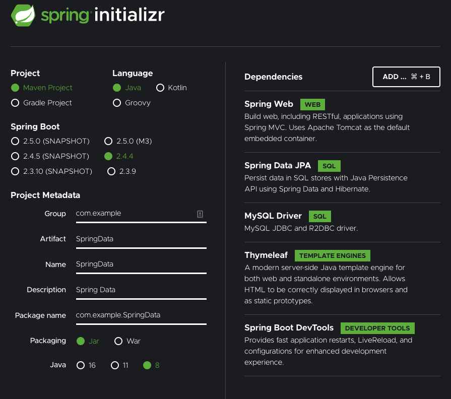

# Spring Data Example

## Step 1:  Create New Template



Add the following;
1. Spring Web
2. Spring Data JPA
3. MySQL Driver
4. Thymeleaf
5. Spring Boot Devtools


## Step 2: Unzip Spring Initializer in your git rep

Use your OS of choice to unzip the SpringStarter.zip in your git repo.


## Step 3: Import the Maven Project into Eclipse (or your IDE of choice)

Go Import -> Existing Maven Project.

Navigate to your git repo folder and find the SpringStarter subfolder.

Select the springtarter subfolder.


## Step 4: Try building.


Eclipse: Right Click -> Run As -> Maven Build...  Then type in goals: spring-boot:run

Or in STS, simply right click -> run as -> Spring Boot App.

Unfortunately, it won't work due to not configured mysql.

## Step 5: Open Up application.properties.

Go to src/main/resources/application.properties
Add the following:

```text
spring.jpa.hibernate.ddl-auto=update
spring.datasource.url=jdbc:mysql://${MYSQL_HOST:localhost}:3306/db_example
spring.datasource.username=springuser
spring.datasource.password=ThePassword

logging.level.org.springframework.web: DEBUG
spring.mvc.view.prefix=/WEB-INF/jsp/
spring.mvc.view.suffix=.jsp
server.port=8090
```


