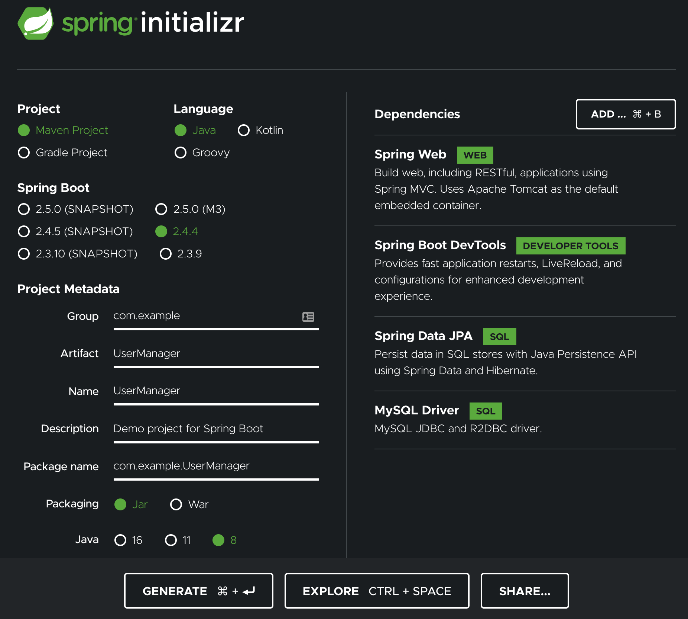

# Searching for a Specific User and Updating the User Information.
## DESCRIPTION

## Project objective:

Create a Spring MVC web application that will retrieve users based on their user ID. The retrieved user data will then be edited in a form and updated in the database. The entire database processing has to be done using Hibernate. Front pages will be made in JSP.

### Background of the problem statement:


As a part of developing an ecommerce web application, the admin backend requires a module that can retrieve users based on their user ID and update their information as required.


### You must use the following:
 

 *  Eclipse as the IDE
 *  Apache Tomcat as the web server (Embedded in jar is fine)
 *  Spring MVC with Hibernate, log4j, and MySQL Connector

 

### Following requirements should be met:

 *  Create a JSP page to take in a user ID
 *  Create a controller that will validate the user ID. If it is invalid, it will display a JSP page with an error message. If it is valid, it will retrieve user details from the database and show an edit form in JSP
 *  Once the edit form is submitted, the controller will update the details in the database. A confirmation JSP page will be shown
 *  Follow the standard methodology of creating controllers, services, respository, and entity classes
 *  Document the step-by-step process involved in completing this task

#### JSP Pages

Here is a potential list of JSPs for the project. (feel free to modify)

 * Index
 * Query User By ID
 * Error for Invalid User Id
 * Edit form for User
 * Confirmation JSP


### SQL

Here is some SQL (not required) that you **could** use if you want to:

```sql
use my_database;
CREATE TABLE `user` (
  `id` int NOT NULL AUTO_INCREMENT,
  `email` varchar(255) DEFAULT NULL,
  `name` varchar(255) DEFAULT NULL,
  `password` varchar(255) DEFAULT NULL,
  PRIMARY KEY (`id`)
) ENGINE=InnoDB DEFAULT CHARSET=utf8mb4 COLLATE=utf8mb4_0900_ai_c
```

```sql
insert into user (email, name, password) VALUES ("tim@gmail.com", "Tim", "password");
insert into user (email, name, password) VALUES ("mary@gmail.com", "Mary", "password");
insert into user (email, name, password) VALUES ("lee@gmail.com", "Lee", "password");
```


## Steps:

###  Step 1: Create a new UserManager Project as the screenshot shows




 
## Step 2: Unzip Spring Initializer in your git rep

Use your OS of choice to unzip the UserManager.zip in your git repo.


## Step 3: Import the Maven Project into Eclipse (or your IDE of choice)

Go Import -> Existing Maven Project.

Navigate to your git repo folder and find the UserManager subfolder.

Select the springtarter subfolder.


## Step 4: Edit application.properties.

Go to src/main/resources/application.properties
Add the following:

```text
spring.jpa.hibernate.ddl-auto=update
spring.datasource.url=jdbc:mysql://${MYSQL_HOST:localhost}:3306/db_example
spring.datasource.username=springuser
spring.datasource.password=ThePassword

logging.level.org.springframework.web: DEBUG
spring.mvc.view.prefix=/WEB-INF/jsp/
spring.mvc.view.suffix=.jsp
server.port=8090
```


## Step 5: Add some extra dependencies to `pom.xml` file

```xml
        <dependency>
                <groupId>javax.servlet</groupId>
                <artifactId>jstl</artifactId>
                <version>1.2</version>
        </dependency>


        <dependency>
             <groupId>org.apache.tomcat.embed</groupId>
             <artifactId>tomcat-embed-jasper</artifactId>
             <scope>provided</scope>
        </dependency>

````

You may need to use eclipse to "Reload Maven" after changing the pom.xml


## Step 6: Create Entity Class: User

Create a new class User.  It can be under the `com.example.UserManager` package.

It can look like this:

```java

package com.example.UserManager.entities;

import javax.persistence.Entity;
import javax.persistence.Id;

@Entity
public class User {
	
	@Id
	private int id;
	private String email;
	private String name;
	private String password;

}
```

Use your IDE of choice to generate setters and getters (Eclipse: Source -> Generate Setters and Getters). 
The result should look like this:

```java

package com.example.UserManager.entities;

import javax.persistence.Entity;
import javax.persistence.Id;

@Entity
public class User {
	
	@Id
	private int id;
	private String email;
	private String name;
	private String password;
	
	public int getId() {
		return id;
	}
	public void setId(int id) {
		this.id = id;
	}
	public String getEmail() {
		return email;
	}
	public void setEmail(String email) {
		this.email = email;
	}
	public String getName() {
		return name;
	}
	public void setName(String name) {
		this.name = name;
	}
	public String getPassword() {
		return password;
	}
	public void setPassword(String password) {
		this.password = password;
	}
}

```


## Step 7: Create A Repository Interface.

Create a new Java Interface called UserRepository.

Paste the following code:

```java
package com.example.UserManager.repositories;

import org.springframework.data.repository.CrudRepository;
import com.example.UserManager.entities.User;


public interface UserRepository extends CrudRepository<User, Integer> {
}
```

## Step 8: Create a User Service

Create a new class called UserService

Paste the following Code:

```java
package com.example.UserManager.services;

import java.util.Optional;

import org.springframework.beans.factory.annotation.Autowired;
import org.springframework.stereotype.Service;
import com.example.UserManager.entities.User;
import com.example.UserManager.repositories.UserRepository;


@Service
public class UserService {

        @Autowired
         private UserRepository userRepository;


    public Iterable<User> GetAllUsers()
    {
        return userRepository.findAll();
    }

}

```

## Step 9: Create UserController

Create a `UserController.java` under the `com.example.UserManager.controllers` package.

```java
package com.example.UserManager.controllers;

import org.springframework.beans.factory.annotation.Autowired;
import org.springframework.stereotype.Controller;
import org.springframework.ui.ModelMap;
import org.springframework.web.bind.annotation.RequestMapping;
import org.springframework.web.bind.annotation.RequestMethod;

import com.example.UserManager.entities.User;
import com.example.UserManager.services.UserService;


@Controller
public class UserController {
	
	
	@Autowired
	private UserService userService;

    @RequestMapping(value="/userquery", method = RequestMethod.GET)
    public String showUsers()
    {
    	return("userquery");
    }
    

}

```

### Step 10: Create UserQuery View

Create a new JSP file in the folder `main/webapp/WEB-INF/jsp/userquery.jsp`.  You will have to create all those
folders yourself in order place the new view in that folder.

Here are the contents of `userquery.jsp`:

```html

<%@ taglib uri="http://java.sun.com/jsp/jstl/core" prefix ="c" %>

<html>
<head>
<style>
table, th, td {
  border: 1px solid black;
}
</style>
</head>
<body>
<h2>User Query</h2>


<form action="userquery" method="post">
  <label for="uid">User Id:</label><br>
  <input type="text" id="uid" name="uid"><br><br>
  <input type="submit" value="Submit">
</form> 


</body>
</html>
```


### Step 11: Create New Methods in UserService:

Add the import as folows:

```java
import java.util.Optional;
```

Add new methods as follows:

```java

    public User GetUserById(int id)
    {
    	//TODO: Handle non-existent user. Currently throws an exception
    	
    	Optional<User> user = userRepository.findById(id);
    	
    	return user.get();
    }

    public User EditUser(User user) {
    	
    	//TODO: Not doing any error checking
    	
    	return userRepository.save(user);
    }
```

### Step 12: Handle post event in UserController:

```java

    @RequestMapping(value="/userquery", method = RequestMethod.POST)
    public String handleQuery(
    		@RequestParam(value = "uid", required = true) Integer uid,
    		ModelMap model) {
    	
    	//TODO: Handle empty or invalid UserId
    	User user = userService.GetUserById(uid);
    	
    	model.addAttribute("user", user);
    
    	return("useredit");
    }

```

### Step 13: Create UserEdit form

Create a UserEdit.jsp page as follows:
 
```html
<%@ taglib uri="http://java.sun.com/jsp/jstl/core" prefix ="c" %>

<html>
<head>
<style>
table, th, td {
  border: 1px solid black;
}
</style>
</head>
<body>
<h2>User Edit</h2>


<form action="useredit" method="post">
  <label for="uid">User Id:</label><br>
  <input type="text" id="uid" name="uid" value="${user.id}"><br>
   <label for="email">Email:</label><br>
  <input type="text" id="email" name="email" value="${user.email}"><br>
  <label for="username">Name:</label><br>
  <input type="text" id="username" name="username" value="${user.name}"><br>
  <label for="password">Password:</label><br>
  <input type="text" id="password" name="password" value="${user.password}"><br>
  
  <br>
  <input type="submit" value="Submit">
</form> 


</body>
</html>
```

### Step 14: Test Application

Run Applicaition. Navigate to `http://localhost:8090/userquery`.

Enter a user that exissts in the db, for example `1`.

You should be forwarded to the useredit form with the correct values filed in.


### Step 15: Handle the useredit post

Add the following:

```java

    @RequestMapping(value="/useredit", method = RequestMethod.POST)
    public String handleEdit(
    		@RequestParam(value = "uid", required = true) Integer uid,
    		@RequestParam(value = "email", required = true) String email,
    		@RequestParam(value = "username", required = true) String username,
    		@RequestParam(value = "password", required = true) String password
    		) {
    	//TODO: Handle empty or invalid UserId
    	User user = userService.GetUserById(uid);
    	    
    	user.setEmail(email);
    	user.setName(username);
    	user.setPassword(password);
    	
    	userService.EditUser(user);
    	return("userquery");
    }

```
### Step 16: Test Application

Run Applicaition. Navigate to `http://localhost:8090/userquery`.

Enter a user that exissts in the db, for example `1`.

You should be forwarded to the useredit form with the correct values filed in.

Go ahead and make a small edit to one of the fields such as password.

Submission should take you back to the userquery form.

Confirm that your changes are stored in teh database.


